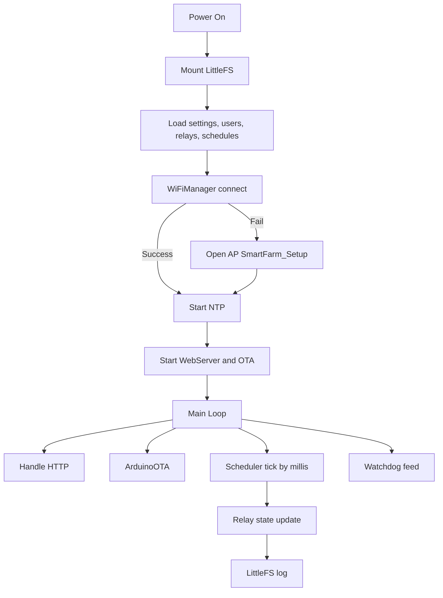

# Flow Diagram

```mermaid
flowchart TD
  A[Power On] --> B[Mount LittleFS]
  B --> C[Load settings, users, relays, schedules]
  C --> D[WiFiManager connect]
  D -->|Success| E[Start NTP]
  D -->|Fail| F[Open AP SmartFarm_Setup]
  F --> E
  E --> G[Start WebServer and OTA]
  G --> H[Main Loop]
  H --> I[Handle HTTP]
  H --> J[ArduinoOTA]
  H --> K[Scheduler tick by millis]
  K --> L[Relay state update]
  L --> M[LittleFS log]
  H --> N[Watchdog feed]
```
